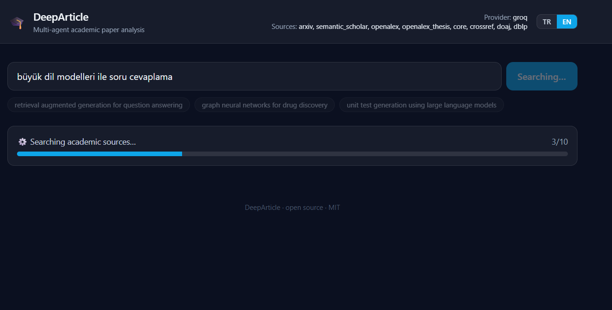
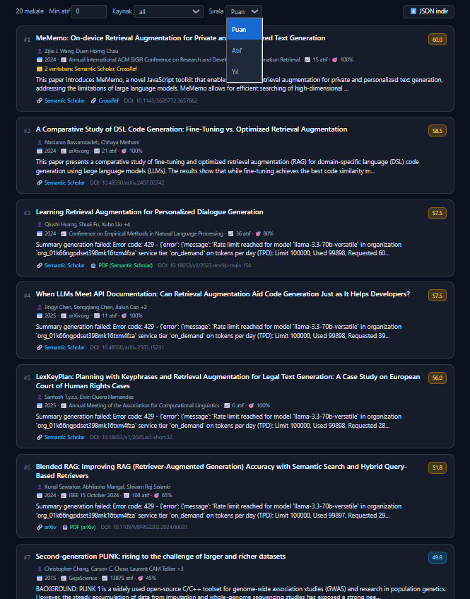
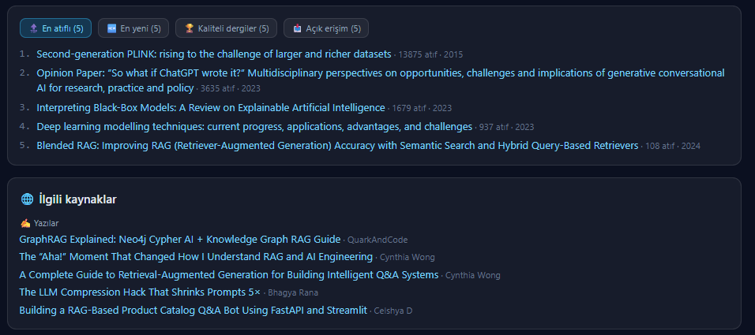
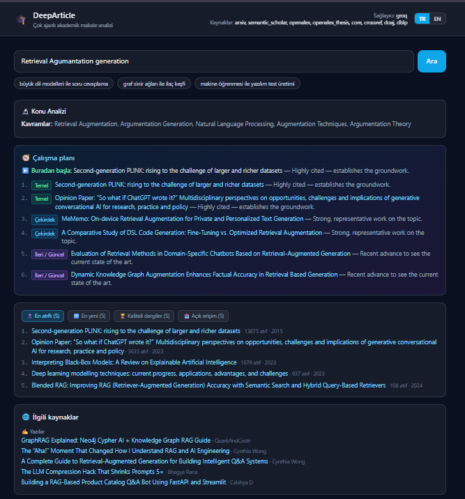

# 🎓 DeepArticle — Multi-Agent Academic Paper Analysis

<div align="center">


**An AI multi-agent system that discovers, ranks and summarizes academic papers — bilingual (TR + EN), with an AI study plan and real supplementary resources.**

</div>

---

## ✨ What it does

- **🔬 Deterministic query analysis** — an LLM extracts the topic's key concepts and a focused, on-topic query set (temperature 0, greedy `top_p`/`top_k` → same topic, same queries, no drift).
- **📚 Multi-source search** — ArXiv, Semantic Scholar, OpenAlex, CORE, CrossRef, DOAJ, DBLP in parallel (OpenAIRE/PubMed optional), with **cross-database dedup** ("found in 2 databases" + both links).
- **🌍 Bilingual (TR + EN)** — queries in both languages; the 🇹🇷/🇬🇧 toggle only translates the UI, never the results.
- **🎯 Language-agnostic LLM reranking** — Haiku re-scores the top candidates by *true* topical relevance and drops off-topic papers, so a Turkish query surfaces the best work in **any** language.
- **📊 Smart ranking** — citations, relevance, venue quality, recency, influence.
- **🧭 AI study plan** — reading path (Foundational → Core → Advanced) + result groups (most-cited / newest / top venues / open access).
- **🌐 Real resources only** — GitHub repos (star-filtered), Medium articles, YouTube videos pulled from live APIs — shown only if they actually exist, never AI-generated.
- **🖥️ Web UI** — FastAPI + React SPA with live agent-progress streaming (SSE). No build step.

---

## 🖼️ Screenshots

**Live search & topic analysis** (Turkish query, EN UI toggle):



**Ranked paper cards** — score badges, filters, and cross-database provenance ("2 veritabanı"):



**Result groups & real related resources:**



**Full AI study plan** (TR mode — topic analysis → reading path → groups → resources):



---

## 📦 Installation

```bash
git clone https://github.com/kadiryonak/DeepArticle.git
cd DeepArticle

python -m venv venv
.\venv\Scripts\activate          # Windows
# source venv/bin/activate       # macOS/Linux

pip install -e ".[api]"          # core + web UI
cp .env.example .env             # then add at least one LLM key
```

**Minimum:** one LLM API key. To run on Claude Haiku (recommended — avoids Groq's daily limits):

```bash
LLM_PROVIDER=anthropic
LLM_MODEL=claude-haiku-4-5
```

| Provider | Get a key | Free tier |
|----------|-----------|-----------|
| **Groq** | [console.groq.com](https://console.groq.com/keys) | ✅ |
| Anthropic | [console.anthropic.com](https://console.anthropic.com/) | ❌ |
| OpenAI | [platform.openai.com](https://platform.openai.com/api-keys) | ❌ |
| Google AI | [makersuite.google.com](https://makersuite.google.com/app/apikey) | ✅ |
| DeepSeek | [platform.deepseek.com](https://platform.deepseek.com/api_keys) | ❌ (very cheap) |

---

## 💻 Usage

```bash
# Web UI (recommended) — open http://localhost:8000
uvicorn api.server:app --reload

# CLI
python main.py "unit test generation using large language models"
python main.py --interactive
```

### 🐳 Docker (any machine, no Python setup)

```bash
cp .env.example .env             # add e.g. GROQ_API_KEY
docker compose up --build        # then open http://localhost:8000
```

The response cache is persisted in a named volume so repeat searches stay fast.

---

## 🏗️ Architecture

A 10-stage LangGraph pipeline:

```
QUERY → 1.Orchestrator → 2.Query Analyzer (deterministic, EN+TR)
      → 3.Search (8+ sources in parallel, cross-DB dedup + provenance)
      → 4.Metadata (citations, SCImago Q-quartile, CrossRef)
      → 5.Analysis + 🎯 language-agnostic LLM rerank (drops off-topic)
      → 6.Summarizer → 7.Prioritizer → 8.Recommender (study plan + groups)
      → 9.Resources (real GitHub / Medium / YouTube) → 10.Output (JSON/Markdown)
```

### Scoring

| Factor | Weight | |  Factor | Weight |
|--------|:------:|--|--------|:------:|
| Citations (log-scaled) | 25% | | Recency | 15% |
| Relevance *(LLM-reranked)* | 25% | | Influence | 15% |
| Venue quality | 20% | | | |

> Keyword relevance is only the first pass and is biased toward the query's language. An LLM then re-scores the top candidates by **language-agnostic** relevance and drops off-topic papers (`ENABLE_RERANK`, `RELEVANCE_MIN`, `RERANK_PROVIDER`/`RERANK_MODEL`).

---

## 📊 Evaluation results (DeepEval)

`105` unit/integration tests pass (offline). A product-level benchmark runs the pipeline over **300 bilingual topics** (150 EN / 150 TR) and scores it with DeepEval (LLM-as-judge).

```bash
python -m evals.benchmark --limit 10          # quick (query metrics)
python -m evals.benchmark --deep --limit 5    # + search + summary metrics
python -m evals.benchmark --safety --limit 5  # + safety metrics
```

**Quality** (higher is better):

| Metric | Bar | Mean | Pass |
|--------|:---:|:----:|:----:|
| `query_relevance` (GEval) | ≥ 0.60 | **0.90** | 100% |
| `bilingual_coverage` | true | — | 100% |
| `query_count` | ≥ 10 | **30** | 100% |
| `retrieval_count` | ≥ 10 | **66–141** | 100% |
| `dedup_integrity` (no dup titles) | true | — | 100% |
| `summary_faithfulness` | ≥ 0.70 | **1.00** | 100% |
| `summary_relevancy` | ≥ 0.60 | ~0.50 | ~50% *(to improve)* |

**Safety** — six DeepEval dimensions, scored by each metric's own `.success`. On benign academic summaries **all six pass**: `Bias` 0.00 · `Toxicity` 0.00 · `Misuse` 0.00 · `PIILeakage` safe · `NonAdvice` safe · `RoleViolation` safe.

**Reranking impact:** a Turkish query for *"large language models for question answering"* drops **16 off-topic papers** (autonomous-vehicle sentiment, digital diplomacy, …) and surfaces the best work in both languages — e.g. *"Türkçe soru cevaplama için büyük dil modelleri"* (rel 95) next to *"Multilingual Benchmarking of LLMs"* (rel 85). Without reranking, keyword relevance ranked unrelated Turkish papers at 100%.

> The full 300-topic `--deep`/`--safety` run makes ~9–11 judge calls per topic, which exceeds Groq's free daily limit (HTTP 429). Use Haiku (`LLM_PROVIDER=anthropic`) or run in `--limit` batches.

> **Agent-trace metrics, MCP & Confident AI** (`TaskCompletion`, `PlanQuality`, `ToolCorrectness`, …) are on the roadmap — they require instrumenting agents with DeepEval `@observe` tracing.

---

## 🔧 Configuration (`.env`)

```bash
LLM_PROVIDER=anthropic               # Haiku avoids Groq's daily limits
LLM_MODEL=claude-haiku-4-5

MAX_SEARCH_QUERIES=12                 # fewer = more focused & on-topic
SOURCES=arxiv,semantic_scholar,openalex,openalex_thesis,core,crossref,doaj,dblp
BILINGUAL_SEARCH=1                    # EN + TR

ENABLE_RERANK=1                       # language-agnostic LLM rerank (run on Haiku)
RELEVANCE_MIN=40                      # drop papers scored below this (0-100)

# Real supplementary resources (omitted entirely if no key / nothing found)
GITHUB_TOKEN=                         # higher rate limit; GITHUB_MIN_STARS=100
YOUTUBE_API_KEY=                      # enable "YouTube Data API v3" in Google Cloud
```

Theses (PhD/Master's) come from `openalex_thesis` and `core` (both multilingual, incl. Turkish); `yoktez` (YÖK Ulusal Tez Merkezi) is best-effort and returns nothing when blocked.

> **Determinism:** topic analysis and reranking run at `temperature=0` with greedy `top_p`/`top_k`, so the same query reliably produces the same keywords, queries and ranking.

---

## 🧪 Tests

```bash
python -m pytest tests/ -v           # 105 offline tests
pytest src/evals/ -v -m eval         # LLM-as-judge evals (needs one key)
```

---

## 📄 License

MIT — free to use for your research. Contributions welcome (see [CONTRIBUTING.md](CONTRIBUTING.md)).

<div align="center">

**Made with ❤️ using LangChain & LangGraph**

</div>
